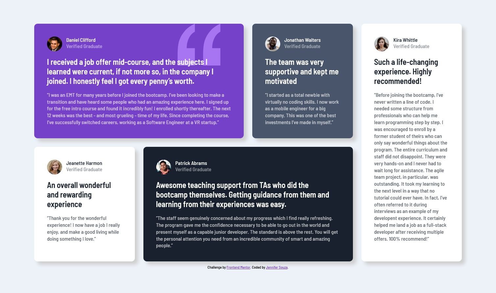

# Frontend Mentor - Testimonials grid section solution

This is a solution to the [Testimonials grid section challenge on Frontend Mentor](https://www.frontendmentor.io/challenges/testimonials-grid-section-Nnw6J7Un7). Frontend Mentor challenges help you improve your coding skills by building realistic projects. 

## Table of contents

- [Overview](#overview)
  - [The challenge](#the-challenge)
  - [Screenshot](#screenshot)
  - [Links](#links)
- [My process](#my-process)
  - [Built with](#built-with)
  - [What I learned](#what-i-learned)
  - [Continued development](#continued-development)
  - [Useful resources](#useful-resources)
- [Author](#author)

## Overview

### The challenge

Users should be able to:

- View the optimal layout for the site depending on their device's screen size

### Screenshot

### Links

- Solution URL: [Add solution URL here](https://your-solution-url.com)
- Live Site URL: [Add live site URL here](https://your-live-site-url.com)

## My process

### Built with

- Semantic HTML5 markup
- CSS custom properties
- Flexbox
- CSS Grid
- Mobile-first workflow

### What I learned

I got more practice with grid, in particular positioning grid items that span columns and rows. I tried to use css properties more effectively. I learned how to position and resize a background image. I learned grid can be an easy way to set vertical margins on items (I saw Kevin Powell do this in a video recently but I can't remember which one).

### Continued development

Continue practicing all the css.

### Useful resources

- [MDN - Background Position](https://developer.mozilla.org/en-US/docs/Web/CSS/background-position) - This helped me remember the syntax for background position.

- [Kevin Powell's YouTube channel](https://www.youtube.com/@KevinPowell) - These videos help with just everything when learning CSS.

## Author

- GitHub - [Jennifer Souza](https://github.com/zoedarkweather)
- Frontend Mentor - [@zoedarkweather](https://www.frontendmentor.io/profile/zoedarkweather)
